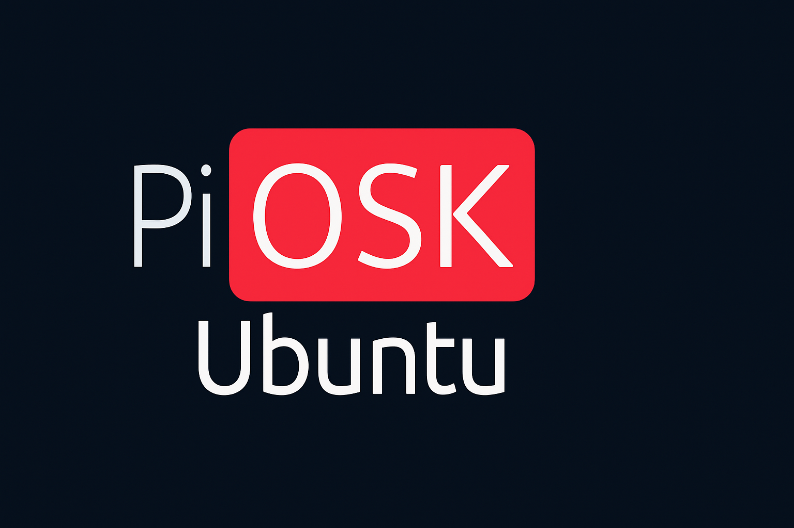
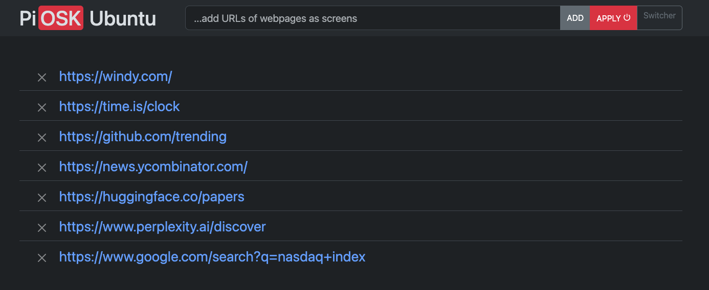
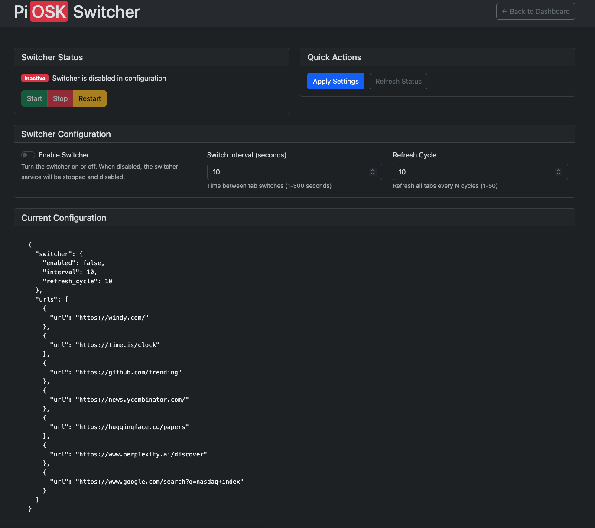

# PiOSK for Ubuntu

**One-shot set up Ubuntu in kiosk mode as a webpage shuffler, with a web interface for management.**

PiOSK transforms your Ubuntu machine into a kiosk mode display that cycles through web pages automatically. It includes a web-based dashboard for easy management of the displayed URLs.

## About This Project

This is an **Ubuntu adaptation** of the original [PiOSK project](https://github.com/debloper/piosk) by [Soumya Deb](https://github.com/debloper). The original PiOSK was designed for Raspberry Pi, and this fork has been modified to work seamlessly on Ubuntu systems.

**Original Project**: [PiOSK by Soumya Deb](https://github.com/debloper/piosk)  
**Original Author**: [Soumya Deb](https://github.com/debloper)  
**License**: MPL-2.0

## Features

- **Automatic Setup**: Single script installation for Ubuntu
- **Web Dashboard**: Manage URLs through a web interface
- **Multi-Screen Support**: Run separate browsers on multiple displays with different content
- **Mode Persistence**: Automatically remembers and restores single-screen or multi-screen mode after reboot
- **Auto-login**: Configures automatic login for your display manager
- **Tab Rotation**: Automatically cycles through configured web pages
- **Switcher Control**: Web interface to control tab switching timing and enable/disable with immediate effect
- **Fullscreen Reliability**: Robust fullscreen mode with timing optimizations for consistent display
- **Systemd Integration**: Runs as system services for reliability
- **Multiple Display Manager Support**: Works with GDM3, LightDM, and SDDM
- **Nginx Reverse Proxy**: Secure web interface on port 80
- **Snap Chromium Support**: Uses Ubuntu's snap Chromium for better compatibility
- **Power Management**: Automatically disables screen saver, auto logout, and power management for kiosk mode
- **System Diagnostics**: Built-in system check tool to verify dependencies and configuration
- **Dependency Validation**: Automatic checks for required software before starting kiosk mode

## System Requirements

- Ubuntu 18.04 LTS or newer
- Desktop environment (GNOME, KDE, XFCE, etc.)
- Internet connection for initial setup
- At least 2GB RAM recommended
- Snap Chromium or system Chromium installed

## Quick Installation

Run the following command in your terminal:

```bash
curl -sSL https://raw.githubusercontent.com/cladkins/piosk-ubuntu/main/scripts/setup.sh | sudo bash -
```

This single command will:
- Install all dependencies
- Configure autologin for your display manager
- Set up the kiosk system
- Install and configure nginx
- Create autostart entries
- Install systemd services

## Manual Installation

1. Clone the repository:
```bash
git clone https://github.com/cladkins/piosk-ubuntu.git
cd piosk-ubuntu
```

2. Run the setup script:
```bash
sudo ./scripts/setup.sh
```

## Configuration

### Basic Setup

1. After installation, visit `http://<your-ubuntu-ip>/` from any device on your network
2. You'll see the PiOSK dashboard with sample URLs
3. Add, remove, or modify the URLs as needed (at least 1 URL is required)
4. Click the `APPLY ⏻` button to apply changes and reboot
5. After reboot, the kiosk mode will start automatically

### Advanced Configuration

The configuration file is located at `config.json` in the project directory. You can edit it directly or use the web interface.

Example configuration:
```json
{
    "urls": [
        {
            "url": "https://example.com"
        },
        {
            "url": "https://another-site.com"
        }
    ]
}
```

## System Diagnostics

PiOSK includes a built-in system check tool to help diagnose installation and configuration issues.

### Using System Check

The System Check button is available in the navigation bar on all pages:

1. Visit the dashboard at `http://<your-ubuntu-ip>/`
2. Click the **System Check** button in the navigation bar
3. View the diagnostic results showing:
   - **Snap**: Whether snap package manager is installed
   - **Chromium**: Whether Chromium browser is installed via snap
   - **jq**: Whether JSON parsing tool is available
   - **DISPLAY**: Current X11 display environment setting

### What System Check Tells You

- **✓ Installed**: Component is properly installed and available
- **✗ Not installed**: Component is missing and needs to be installed
- **Display value**: Shows the current X11 DISPLAY environment variable

### Installing Missing Dependencies

If System Check shows missing components:

```bash
# Install snap (if missing)
sudo apt update && sudo apt install snapd

# Install Chromium browser
sudo snap install chromium

# Install jq for JSON processing
sudo apt install jq
```

### Common Issues Detected

- **Chromium not installed**: Kiosk mode won't start without a browser
- **jq missing**: Configuration files can't be processed
- **DISPLAY not set**: Browser won't know which screen to use
- **Snap not available**: Can't install or run Chromium

## Display Manager Support

The setup script automatically detects and configures your display manager:

- **GDM3** (GNOME): Most common on Ubuntu
- **LightDM**: Used by XFCE and some other desktop environments
- **SDDM**: Used by KDE Plasma

## How It Works

1. **Autologin**: The system automatically logs in to the desktop on boot
2. **Smart Startup**: The `runner-smart.sh` script detects the last used mode and starts either single-screen or multi-screen mode
3. **Autostart**: The kiosk application starts automatically when the desktop loads
4. **Web Dashboard**: Nginx serves the management interface on port 80
5. **Tab Rotation**: Chromium cycles through configured URLs in kiosk mode
6. **Configuration**: Changes made through the web interface are saved and applied immediately
7. **Mode Persistence**: The system remembers which mode was active and restores it after reboot
8. **Power Management**: Screen saver, auto logout, and power management are automatically disabled

## Power Management

PiOSK automatically configures power management settings to ensure the kiosk display remains active:

### What Gets Disabled
- **Screen Saver**: Prevents the screen from going to sleep
- **Auto Logout**: Prevents automatic user logout due to inactivity
- **Display Power Management**: Prevents the display from turning off
- **System Sleep/Hibernate**: Prevents the system from sleeping
- **Session Management**: Disables automatic session saving and restoration

### Desktop Environment Support
The power management configuration works with:
- **GNOME/Unity**: Uses gsettings to configure power management
- **KDE Plasma**: Uses dconf to configure powerdevil settings
- **XFCE**: Uses dconf to configure XFCE power manager
- **X11 Fallback**: Uses xset for basic screen saver control

### Manual Power Settings
If you need to apply power settings manually:

```bash
# Check current power management status
gsettings get org.gnome.desktop.screensaver idle-activation-enabled
```

### Reverting Power Settings
To restore normal power management behavior:

```bash
# Remove PiOSK completely (includes power settings)
sudo ./scripts/cleanup.sh
```

## Multi-Screen Support

PiOSK now supports multiple displays, allowing you to run separate browsers on each connected monitor with different web content.

### Features
- **Automatic Display Detection**: Detects all connected monitors
- **Per-Screen Configuration**: Configure different URLs for each display
- **Independent Control**: Start, stop, and manage each screen individually
- **Web-Based Management**: Easy-to-use web interface for multi-screen control

### Accessing Multi-Screen Controls
1. Visit the main dashboard at `http://<your-ubuntu-ip>/`
2. Click the "Multi-Screen" button in the navigation bar
3. Or go directly to `http://<your-ubuntu-ip>/multiscreen.html`

### Using Multi-Screen Mode

#### Basic Setup
1. **Detect Displays**: Click "Detect Displays" to scan for connected monitors
2. **Configure Screens**: Set different URLs for each detected display
3. **Start Multi-Screen**: Click "Start Multi-Screen" to launch all screens simultaneously

**Note**: When switching from single-screen to multi-screen mode, there's an automatic 5-second wait after stopping existing processes to ensure proper cleanup before starting new browsers. This prevents timing conflicts and ensures all screens launch properly in fullscreen mode.

#### Individual Screen Management
- **Configure**: Enter URLs for each screen (one per line in the text area)
- **Save**: Save configuration for specific screens
- **Start/Stop**: Control individual screens independently

#### Command Line Usage
```bash
# Detect available displays
./scripts/detect-displays.sh

# Start multi-screen mode
./scripts/runner-multiscreen.sh

# Stop all screens
sudo pkill -f "chromium.*kiosk"
```

### Multi-Screen Configuration
Screen configurations are stored in `./screens/` as JSON files:
- `:0.json` - Configuration for primary display
- `:1.json` - Configuration for secondary display
- etc.

Example screen configuration:
```json
{
  "urls": [
    {"url": "https://time.is"},
    {"url": "https://weather.com"}
  ]
}
```

### Switching Between Modes
- **Single-Screen Mode**: Use the original dashboard and runner
- **Multi-Screen Mode**: Use the multi-screen interface and runner
- Both modes can coexist and be switched between as needed

### Mode Persistence Through Reboot
PiOSK automatically remembers which mode (single-screen or multi-screen) was last active and restores it after system reboot:

- **Automatic Detection**: The system detects which mode was running before reboot
- **Smart Startup**: Uses `runner-smart.sh` to start the correct mode on boot
- **State Storage**: Last mode is saved to `last-mode.txt` when starting any mode
- **Fallback**: Defaults to single-screen mode if no previous state is found

#### How It Works
1. When you start **single-screen mode**: Saves "single-screen" to state file
2. When you start **multi-screen mode**: Saves "multi-screen" to state file  
3. On system **reboot/login**: `runner-smart.sh` reads the state file and starts the correct mode
4. **No manual intervention needed**: The system automatically restarts in the same mode you were using

This ensures your kiosk display configuration persists through power cycles and system restarts without requiring manual reconfiguration.

## Switcher Control

PiOSK includes a web-based switcher control interface that allows you to manage tab rotation settings:

### Accessing Switcher Controls
1. Visit the main dashboard at `http://<your-ubuntu-ip>/`
2. Click the "Switcher" button in the navigation bar
3. Or go directly to `http://<your-ubuntu-ip>/switcher.html`

### Switcher Settings
- **Enable/Disable**: Turn the switcher on or off completely. When disabled, the switcher service will be stopped and disabled. When enabled, the service will be started and enabled to run automatically.
- **Switch Interval**: Set the time between tab switches (1-300 seconds)
- **Refresh Cycle**: Configure how often all tabs are refreshed (1-50 cycles)

### Switcher Controls
- **Start**: Manually start the switcher service (only available when switcher is enabled in configuration)
- **Stop**: Manually stop the switcher service (immediate effect)
- **Restart**: Restart the switcher service (only available when switcher is enabled in configuration)
- **Apply Settings**: Save configuration changes and automatically enable/disable the switcher service

### How Enable/Disable Works
- **When you enable the switcher**: The systemd service is automatically enabled and started
- **When you disable the switcher**: The systemd service is automatically stopped and disabled
- **Status feedback**: The interface shows whether the switcher is "Active", "Inactive - Switcher is disabled in configuration", or "Inactive - Switcher is stopped"
- **Button states**: Start/restart buttons are disabled when the switcher is disabled in configuration

### Configuration
Switcher settings are stored in `config.json`:

```json
{
    "switcher": {
        "enabled": true,
        "interval": 10,
        "refresh_cycle": 10
    },
    "urls": [...]
}
```

## Troubleshooting

### Quick Diagnosis

**Start here first**: Use the **System Check** button in the web interface to check for common issues.

### Common Issues

1. **Kiosk mode won't start**: Click **System Check** to verify Chromium, snap, and jq are installed
2. **Display not working**: Ensure you're logged into a desktop session
3. **Web dashboard not accessible**: Check if nginx is running: `sudo systemctl status nginx`
4. **Chromium not starting**: Verify display permissions and X11 setup
5. **Auto-login not working**: Check your display manager configuration
6. **"Error: Chromium snap is not installed"**: Run `sudo snap install chromium`
7. **"Error: jq is not installed"**: Run `sudo apt install jq`
8. **"Error: snap is not installed"**: Run `sudo apt update && sudo apt install snapd`
9. **Screen still going to sleep**: Check if power management service is running: `systemctl --user status piosk-power-management.service`
10. **Power settings not persisting**: Check if the systemd user service is enabled: `systemctl --user status piosk-power-management.service`
11. **Dashboard not accessible (502 error)**: Check if the dashboard service is running: `sudo systemctl status piosk-dashboard`
12. **Dashboard service won't start**: Try running manually in project directory: `npm start`
13. **Switcher not working**: Check if the switcher service is running: `sudo systemctl status piosk-switcher`
14. **Tabs not switching**: Verify Chromium is running and switcher service is active
15. **Wrong mode starts after reboot**: Check the persistence state file: `cat /opt/piosk/last-mode.txt`
16. **Mode persistence not working**: Verify `runner-smart.sh` is being used in autostart instead of `runner.sh`

### Error Logs

If kiosk mode fails to start, check these log files for detailed error messages:

```bash
# Single-screen mode logs
cat /tmp/piosk-single.log

# Multi-screen mode logs (per display)
cat /tmp/piosk-:0.log
cat /tmp/piosk-:1.log
```

### Service Management

Check service status:
```bash
# Dashboard service (system service)
sudo systemctl status piosk-dashboard

# Runner service (system service) 
sudo systemctl status piosk-runner

# Switcher service (user service)
systemctl --user status piosk-switcher

# View switcher logs
journalctl --user -u piosk-switcher -f
```

### Switcher Service Issues

If the switcher controls aren't working in the dashboard:

1. **Check if switcher service is running:**
   ```bash
   systemctl --user status piosk-switcher
   ```

2. **Check if switcher is enabled in configuration:**
   ```bash
   cat config.json | jq '.switcher.enabled'
   ```

3. **Check dashboard service environment:**
   ```bash
   sudo systemctl show piosk-dashboard --property=User,Environment
   ```

4. **Test switcher endpoints directly:**
   ```bash
   curl http://localhost:3000/switcher/status
   ```

5. **Restart dashboard service:**
   ```bash
   sudo systemctl restart piosk-dashboard
   ```

6. **Enable switcher service manually:**
   ```bash
   systemctl --user enable piosk-switcher
   systemctl --user start piosk-switcher
   ```

7. **If switcher is disabled in config but you want to enable it:**
   - Use the web interface to toggle the "Enable Switcher" checkbox
   - Click "Apply Settings"
   - The service should automatically start

### Mode Status Checking

Check the current mode status and persistence state:

```bash
# Check current mode status via API
curl http://localhost:3000/mode/status

# Check persistence state file directly  
cat /opt/piosk/last-mode.txt

# Check which runner script is being used in autostart
cat ~/.config/autostart/piosk-kiosk.desktop | grep Exec
```

### Manual Display Manager Configuration

If auto-login doesn't work automatically, you can configure it manually:

#### GDM3
```bash
sudo nano /etc/gdm3/custom.conf
```
Add:
```ini
[daemon]
AutomaticLoginEnable=true
AutomaticLogin=yourusername
```

#### LightDM
```bash
sudo nano /etc/lightdm/lightdm.conf
```
Add:
```ini
[SeatDefaults]
autologin-user=yourusername
autologin-user-timeout=0
```

#### SDDM
```bash
sudo nano /etc/sddm.conf.d/autologin.conf
```
Add:
```ini
[Autologin]
User=yourusername
Session=ubuntu.desktop
```

## Uninstallation

To remove PiOSK from your Ubuntu system:

```bash
sudo ./scripts/cleanup.sh
```

## Security Considerations

- The web dashboard runs on port 80 through nginx
- The kiosk mode runs with reduced privileges
- Consider disabling unnecessary network services for production use
- The system automatically logs in, so ensure physical security

## Differences from Original PiOSK

This Ubuntu version includes several improvements over the original Raspberry Pi version:

- **Ubuntu-specific setup**: Optimized for Ubuntu systems
- **Snap Chromium support**: Better compatibility with Ubuntu's package management
- **Nginx reverse proxy**: More robust web server setup
- **Autostart entries**: Better X11 authorization handling
- **Systemd services**: Improved service management
- **Multiple display manager support**: Works with GDM3, LightDM, and SDDM

## Contributing

This is an Ubuntu adaptation of the original [PiOSK project](https://github.com/debloper/piosk). 

- **Original Project**: [PiOSK by Soumya Deb](https://github.com/debloper/piosk)
- **Original Author**: [Soumya Deb](https://github.com/debloper)
- **This Fork**: [PiOSK Ubuntu by cladkins](https://github.com/cladkins/piosk-ubuntu)

For issues with this Ubuntu version, please check:
1. Your Ubuntu version and desktop environment
2. Display manager configuration
3. Network connectivity
4. Service logs: `sudo journalctl -u piosk-*`

## License

MPL-2.0 - Same license as the original PiOSK project

---

**Credits**: This project is based on the original [PiOSK](https://github.com/debloper/piosk) by [Soumya Deb](https://github.com/debloper), adapted for Ubuntu systems.


